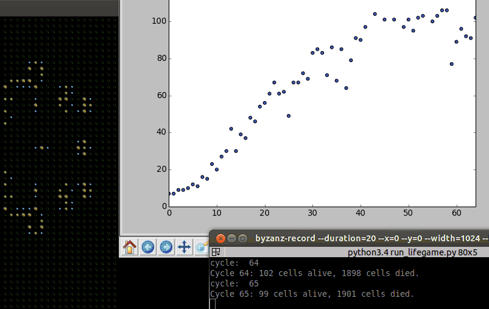

.. _LifeGame:

HowTo Project: LifeGame
***********************

Objective
=========

This howto will help you to discover synergine with a simple implementation. We will only show you the code of main
logic. But all not displayed code here is described in main documentation.

The howto project implement the "Conway's Game of Life".

From Wikipedia, the free encyclopedia::

   The Game of Life, also known simply as Life, is a cellular automaton devised by
   the British mathematician John Horton Conway in 1970.

   The "game" is a zero-player game, meaning that its evolution is determined by
   its initial state, requiring no further input. One interacts with the Game of
   Life by creating an initial configuration and observing how it evolves or, for
   advanced players, by creating patterns with particular properties.

First steps
===========

.. Note::

    The ``LifeGame howto`` source code is available at `https://github.com/buxx/synergine_lifegame.git <https://github.com/buxx/synergine_lifegame.git>`_.

You will need some dependencies:

>>> pip install synergine
>>> pip install synergine_xyz

Content of simulation
=====================

Our simulation will implement a basic pattern of "Conway's Game of Life" and visualisation tools.

Simulation
----------

The objective is to implement the `rules of "Conway's Game of Life" <http://en.wikipedia.org/wiki/Conway%27s_Game_of_Life#Rules>`_.
From Wikipedia, the free encyclopedia::

   The universe of the Game of Life is an infinite two-dimensional orthogonal
   grid of square cells, each of which is in one of two possible states, alive
   or dead. Every cell interacts with its eight neighbours, which are the
   cells that are horizontally, vertically, or diagonally adjacent. At each
   step in time, the following transitions occur:

   1. Any live cell with fewer than two live neighbours dies, as if caused by
      under-population.
   2. Any live cell with two or three live neighbours lives on to the next generation.
   3. Any live cell with more than three live neighbours dies, as if by overcrowding.
   4. Any dead cell with exactly three live neighbours becomes a live cell, as if by
      reproduction.

   The initial pattern constitutes the seed of the system. The first generation
   is created by applying the above rules simultaneously to every cell in the
   seed—births and deaths occur simultaneously, and the discrete moment at which
   this happens is sometimes called a tick (in other words, each generation is a
   pure function of the preceding one). The rules continue to be applied repeatedly
   to create further generations.

Additional features
-------------------

In additional of "Conway's Game of Life" rules, we will represent differently in our 2d graphic output:

* A just born cell
* A born cell since 2 cycles
* A born cell since more 2 cycles

Prerequisite
------------

To correctly follow this tutorial, remember to work with Python 3.4 interpreter and create in your project directory a
``synergine_lifegame`` (sources files will be placed in) directory. Different command are executed from your
project directory.

Constants
---------

First, we have to prepare some constants to feed our :ref:`metas data <Components.Metas>`. There it is:

**synergine_lifegame/cst.py**:

.. include:: ./synergine_lifegame/synergine_lifegame/cst.py
   :literal:

SynergyObjects
--------------

.. _LifeGame.Cell:

We need: A Cell.

**synergine_lifegame/synergy/object/Cell.py**:

.. include:: ./synergine_lifegame/synergine_lifegame/synergy/object/Cell.py
   :literal:

.. Note::

    Cell class is a child class of :ref:`synergine_xyz.SynergyObject.SynergyObject <ModuleXyzworld.SynergyObject>`.

And no more for our SynergyObjects.

.. _LifeGame.EventActions:

Events and Actions
------------------

AliveAroundEvent
++++++++++++++++

.. _LifeGame.Event.AliveAroundEvent:

Events/Actions will be "born" and "die". These actions will need to know how many alive cells are around the concerned
cell. So we write AliveAroundEvent event:

**synergine_lifegame/synergy/event/AliveAroundEvent.py**:

.. include:: ./synergine_lifegame/synergine_lifegame/synergy/event/AliveAroundEvent.py
   :literal:

Born and die event will be child of this event.

Born
++++

.. _LifeGame.Event.Born:

The born event:

**synergine_lifegame/synergy/event/GoodConditionToBornEvent.py**:

.. include:: ./synergine_lifegame/synergine_lifegame/synergy/event/GoodConditionToBornEvent.py
   :literal:

.. _LifeGame.Action.Born:

And his action:

**synergine_lifegame/synergy/event/BornAction.py**:

.. include:: ./synergine_lifegame/synergine_lifegame/synergy/event/BornAction.py
   :literal:

Die
++++

The die event:

**synergine_lifegame/synergy/event/NotGoodConditionToPersistEvent.py**:

.. include:: ./synergine_lifegame/synergine_lifegame/synergy/event/NotGoodConditionToPersistEvent.py
   :literal:

And his action:

**synergine_lifegame/synergy/event/DieAction.py**:

.. include:: ./synergine_lifegame/synergine_lifegame/synergy/event/DieAction.py
   :literal:

AroundMechanism
+++++++++++++++

As you can see, these events uses the :ref:`AroundMechanism <ModuleXyzworld.Mechanism.AroundMechanism>`. This mechanism prepare a list of object ids who are around the observed object.

Collection
----------

Our Cells must be contained by a Collection.

**synergine_lifegame/synergy/collection/LifeGameCollection.py**:

.. include:: ./synergine_lifegame/synergine_lifegame/synergy/collection/LifeGameCollection.py
   :literal:

The collection must have a configuration (to populate his synergies objects).

**synergine_lifegame/synergy/collection/LifeGameCollectionConfiguration.py**:

.. include:: ./synergine_lifegame/synergine_lifegame/synergy/collection/LifeGameCollectionConfiguration.py
   :literal:

And a Simulation container.

**synergine_lifegame/synergy/LifeGameSimulation.py**:

.. include:: ./synergine_lifegame/synergine_lifegame/synergy/LifeGameSimulation.py
   :literal:

Additional features
-------------------

According to our additional features::

    In additional of "Conway's Game of Life" rules, we will represent differently in our 2d graphic output:

    * A just born cell
    * A born cell since 2 cycles
    * A born cell since more 2 cycles

We must add an Action who have to increment age of alive cells:

**synergine_lifegame/synergy/event/TimePassAction.py**:

.. include:: ./synergine_lifegame/synergine_lifegame/synergy/event/TimePassAction.py
   :literal:

Who listen a simple event:

**synergine_lifegame/synergy/event/TimePassEvent.py**:

.. include:: ./synergine_lifegame/synergine_lifegame/synergy/event/TimePassEvent.py
   :literal:

Simple terminal
---------------

All needed algorithms are here. To be able to see something, we write a very simple output like this:

**synergine_lifegame/PrintTerminal.py**:

.. include:: ./synergine_lifegame/synergine_lifegame/PrintTerminal.py
   :literal:

Let's go
--------

.. _LifeGame.run_conf1:

We now need to prepare configuration and run script for our simulation (**run.py**) ::

    from synergine.core.Core import Core

    from synergine_lifegame.PrintTerminal import PrintTerminal
    from synergine_lifegame.synergy.collection.LifeGameCollection import LifeGameCollection
    from synergine_lifegame.synergy.LifeGameSimulation import LifeGameSimulation
    from synergine_lifegame.synergy.collection.LifeGameCollectionConfiguration import LifeGameCollectionConfiguration
    from synergine_xyz.Context import Context as XyzContext

    config = {
        'app': {
            'name': 'LifeGame simulation',
            'classes': {
                'Context': XyzContext
            }
        },
        'engine': {
            'fpsmax': 5,
        },
        'simulations': [LifeGameSimulation([LifeGameCollection(LifeGameCollectionConfiguration())])],
        'connections': [PrintTerminal]
    }

    if __name__ == '__main__':
        # Run simulation
        Core.start_core(config)

We execute script and, tadaaa::

    python3.4 run.py
    Cycle 0: 7 cells alive, 1993 cells died.
    Cycle 1: 7 cells alive, 1993 cells died.
    Cycle 2: 9 cells alive, 1991 cells died.
    Cycle 3: 9 cells alive, 1991 cells died.
    Cycle 4: 10 cells alive, 1990 cells died.
    Cycle 5: 12 cells alive, 1988 cells died.
    Cycle 6: 11 cells alive, 1989 cells died.
    Cycle 7: 16 cells alive, 1984 cells died.
    Cycle 8: 15 cells alive, 1985 cells died.
    Cycle 9: 23 cells alive, 1977 cells died.
    Cycle 10: 20 cells alive, 1980 cells died.

Outputs
=======

You can create all terminals you want. Some example:

.. _LifeGame.Pygame:

2D pygame
---------

.. Note::

    To install PyGame for Python 3.x you can follow `these steps <http://www.pygame.org/wiki/CompileUbuntu>`_:

    >>> sudo apt-get install python3-scipy python3-matplotlib

:ref:`Xyzworld module <ModuleXyzworld>` delivery a ready to use PygameDisplay. We just need to prepare a display configuration for it:

**synergine_lifegame/display/pygame_visualisation.py**:

.. include:: ./synergine_lifegame/synergine_lifegame/display/pygame_visualisation.py
   :literal:

And add it to :ref:`run configuration <LifeGame.run_conf1>` (**run.py**) ::

    from lifegame.synergy.LifeGameSimulation import LifeGameSimulation
    from lifegame.synergy.collection.LifeGameCollectionConfiguration import LifeGameCollectionConfiguration
    from synergine_xyz.Context import Context as XyzContext
    +from synergine_xyz.display.PygameDisplay import PygameDisplay
    +from synergine_lifegame.display.pygame_visualisation import visualisation as pygame_visualisation

    # ...

    'simulations': [LifeGameSimulation([LifeGameCollection(LifeGameCollectionConfiguration())])],
    -    'connections': [PrintTerminal]
    +    'connections': [PrintTerminal, PygameDisplay],
    +    'terminal': {
    +        'pygame': {
    +            'visualisation': pygame_visualisation,
    +            'window_size': (1024, 768),
    +            'display': {
    +                'grid': {
    +                    'size': 20
    +                }
    +            }
    +        },
    +    }
    }

    if __name__ == '__main__'

Then unzip these :download:`images <../resources/pygame_lifegame_images.zip>` into **synergine_lifegame/display/pygame/** folder.

When we run our simulation we can now see a beautiful 2D render :

   LifeGame simulation capture of 2D pygame output.

Plot
----

.. Note::

    To get matplotlib and scipy dependencies on debian-like system you can execute:

    >>> sudo apt-get install python3-scipy python3-matplotlib

For example, we want to display a plot with history of alive cells count. We create a new Terminal:

**synergine_lifegame/PlotTerminal.py**:

.. include:: ./synergine_lifegame/synergine_lifegame/PlotTerminal.py
   :literal:

And add it to :ref:`run configuration <LifeGame.run_conf1>` (**run.py**) ::

    from lifegame.synergy.collection.LifeGameCollectionConfiguration import LifeGameCollectionConfiguration
    from synergine_xyz.Context import Context as XyzContext
    from synergine_xyz.display.PygameDisplay import PygameDisplay
    +from synergine_lifegame.PlotTerminal import PlotTerminal

    # ...

    -    'connections': [PrintTerminal, PygameDisplay]
    +    'connections': [PrintTerminal, PygameDisplay, PlotTerminal],

And let see result:

